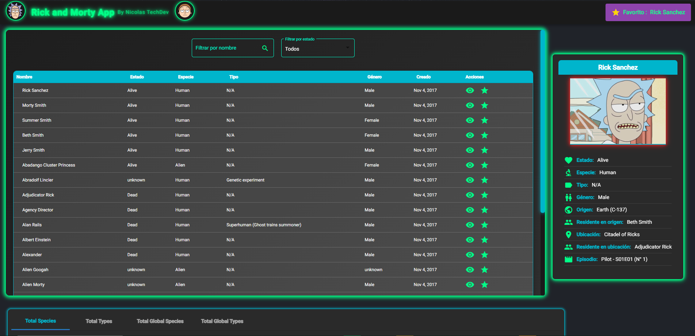
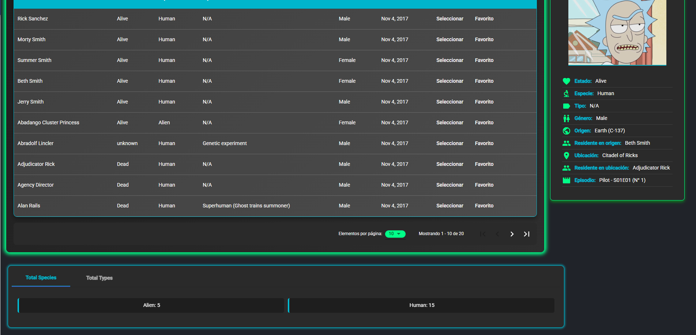
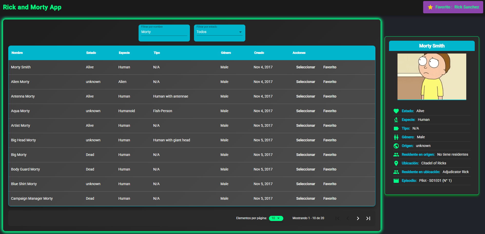

# 🚀 Rick and Morty App - Angular 14

A **dashboard-style** application that uses the public [Rick and Morty API](https://rickandmortyapi.com/) to display characters from the series. It includes a **paginator**, **advanced search functions**, and a modern design with **Angular Material**.

## 📷 Preview

Here are some screenshots of the application:

### 🖼️ Home Page



### 🔎 Character Search using Favorite character



### 🔎 Character Search



## 🔧 Technologies Used

- **Angular 14**
- **Angular Material**
- **TypeScript**
- **RxJS**
- **Rick and Morty Public API**

## 📥 Installation & Setup

To run the project locally, follow these steps:

1. Clone the repository:

   ```bash
   git clone https://github.com/Nicooo20/rick-morty-app-angular.git

   ```

2. Navigate into the project folder:
   cd rick-morty-app-angular

3. Install dependencies:
   npm install

4. Start the development server:
   ng serve

5. Open your browser and visit:
   http://localhost:4200/

🔎 Features
✅ Fully responsive design (mobile-friendly)
✅ More functions !!!

## 📬 Contact

If you have any questions or suggestions, feel free to reach out:

- 📧 Email: [nicolas.techdev@gmail.com](mailto:nicolas.techdev@gmail.com)
- 🐙 GitHub: [Nicooo20](https://github.com/Nicooo20)
